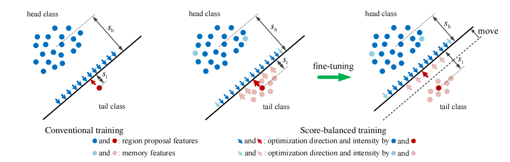
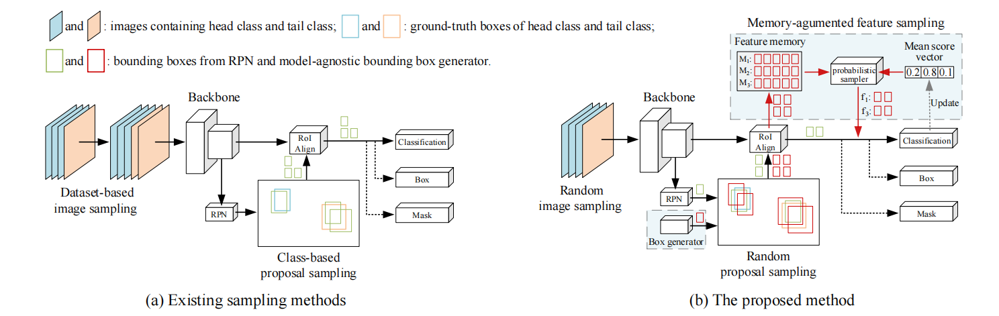

# Exploring Classification Equilibrium in Long-Tailed Object Detection (LOCE, ICCV 2021)
[Paper](https://arxiv.org/abs/2108.07507) &nbsp; &nbsp; [Website](https://fcjian.github.io/loce)

## Introduction

The conventional detectors tend to make imbalanced classification and suffer performance drop, when the distribution of the training data is severely skewed. In this paper, we propose to use the mean classification score to indicate the classification accuracy for each category during training. Based on this indicator, we balance the classification via an Equilibrium Loss (EBL) and a Memory-augmented Feature Sampling (MFS) method. Specifically, EBL increases the intensity of the adjustment of the decision boundary for the weak classes by a designed score-guided loss margin between any two classes. On the other hand, MFS improves the frequency and accuracy of the adjustments of the decision boundary for the weak classes through over-sampling the instance features of those classes. Therefore, EBL and MFS work collaboratively for finding the classification equilibrium in long-tailed detection, and dramatically improve the performance of tail classes while maintaining or even improving the performance of head classes. We conduct experiments on LVIS using Mask R-CNN with various backbones including ResNet-50-FPN and ResNet-101-FPN to show the superiority of the proposed method. It improves the detection performance of tail classes by 15.6 AP, and outperforms the most recent long-tailed object detectors by more than 1 AP.
### Method overview


### Memory-augmented Feature Sampling (MFS)


## Prerequisites

- MMDetection version 2.8.0.

- Please see [get_started.md](docs/get_started.md) for installation and the basic usage of MMDetection.

## Train

```python
# assume that you are under the root directory of this project,
# and you have activated your virtual environment if needed.
# and with LVIS v1.0 dataset in 'data/lvis_v1/'.
# use decoupled training pipeline:

# 1. train the model with Mask R-CNN
./tools/dist_train.sh configs/loce/mask_rcnn_r50_fpn_normed_mask_mstrain_2x_lvis_v1.py 8

# 2. fine-tune the model with LOCE
./tools/dist_train.sh configs/loce/loce_mask_rcnn_r50_fpn_normed_mask_mstrain_2x_lvis_v1.py 8
```

## Inference

```python
./tools/dist_test.sh configs/loce/loce_mask_rcnn_r50_fpn_normed_mask_mstrain_2x_lvis_v1.py work_dirs/loce_mask_rcnn_r50_fpn_normed_mask_mstrain_2x_lvis_v1/epoch_6.pth 8 --eval bbox segm
```

## Models

For your convenience, we provide the following trained models (LOCE). All models are trained with 16 images in a mini-batch.

Model | Dataset | MS train | box AP | mask AP | Pretrained Model | LOCE
--- |:---:|:---:|:---:|:---:|:---:|:---:
LOCE_R_50_FPN_2x              | LVIS v0.5  | Yes  | 28.2 | 28.4 | [config](configs/loce/mask_rcnn_r50_fpn_normed_mask_mstrain_2x_lvis_v0.5.py) / [model](https://drive.google.com/file/d/16frTka2FqL0ndEtm14VcpJiiIpbvNl__/view?usp=sharing) | [config](configs/loce/loce_mask_rcnn_r50_fpn_normed_mask_mstrain_2x_lvis_v0.5.py) / [model](https://drive.google.com/file/d/11hwgo038D4mE0TXm1j6wD0soJD319KyC/view?usp=sharing)
LOCE_R_50_FPN_2x              | LVIS v1.0  | Yes  | 27.4 | 26.6 | [config](configs/loce/mask_rcnn_r50_fpn_normed_mask_mstrain_2x_lvis_v1.py) / [model](https://drive.google.com/file/d/14Uwif11F-0scNiIwucZP2VTG9TiO-aSS/view?usp=sharing) | [config](configs/loce/loce_mask_rcnn_r50_fpn_normed_mask_mstrain_2x_lvis_v1.py) / [model](https://drive.google.com/file/d/138D2IVc5Z4x1JAKA2WmRf1yhHbxd8Hvk/view?usp=sharing)
LOCE_R_101_FPN_2x             | LVIS v1.0  | Yes  | 29.0 | 28.0 | [config](configs/loce/mask_rcnn_r101_fpn_normed_mask_mstrain_2x_lvis_v1.py) / [model](https://drive.google.com/file/d/1JSjCYAvmT8G5G24Lo0lw5LWdTCMI9wea/view?usp=sharing) | [config](configs/loce/loce_mask_rcnn_r101_fpn_normed_mask_mstrain_2x_lvis_v1.py) / [model](https://drive.google.com/file/d/1lJExnD450fJobXFnS7StO95ohoFshjxW/view?usp=sharing)

[0] *All results are obtained with a single model and without any test time data augmentation such as multi-scale, flipping and etc..* \
[1] *Refer to more details in config files in `config/loce/`.*


## Acknowledgement

Thanks MMDetection team for the wonderful open source project!


## Citation

If you find LOCE useful in your research, please consider citing:

```
@inproceedings{feng2021exploring,
    title={Exploring Classification Equilibrium in Long-Tailed Object Detection},
    author={Feng, Chengjian and Zhong, Yujie and Huang, Weilin},
    booktitle={ICCV},
    year={2021}
}
```


